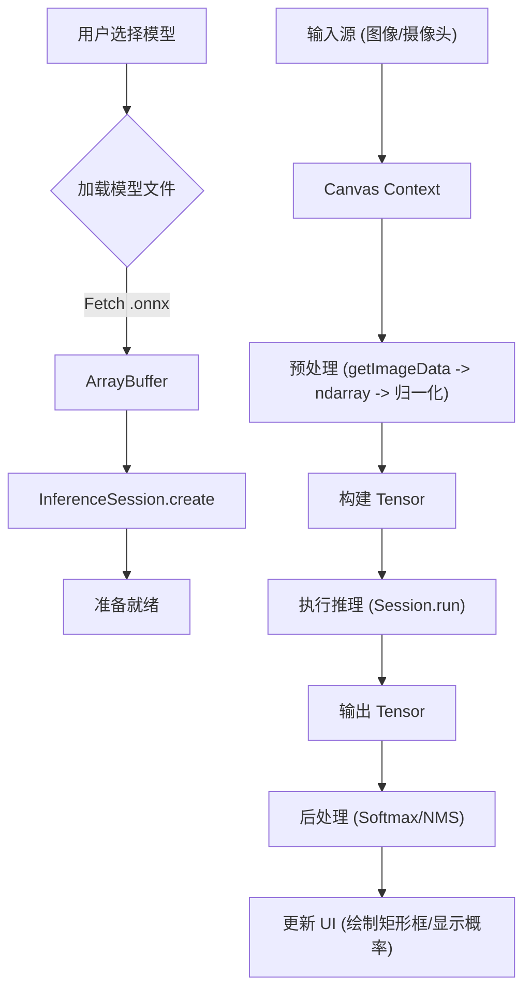

# 项目源码分析报告

## 1. 项目概览
这是一个基于 **Vue.js** 和 **ONNX Runtime Web** 的前端深度学习推理演示项目。项目通过 Vue 组件化开发，展示了 MobileNet, SqueezeNet, Emotion FerPlus, Yolo, MNIST 等多个模型的浏览器端推理能力。

---

## 2. 核心架构与流程

### 2.1 路由与菜单 (MainMenu.vue & router)
用户点击菜单时，通过 Vue Router 跳转到对应的模型组件。
*   **入口**: `src/components/MainMenu.vue` 定义了导航菜单。
*   **路由**: `src/router/index.ts` 将路径映射到具体的组件 (e.g., `/mobilenet` -> `MobileNet.vue`)。

### 2.2 四个关键模型的实现方式
这四个模型（MobileNet, SqueezeNet, Emotion, Yolo）主要利用了两个通用的 UI 封装组件来简化开发：
1.  **ImageModelUI.vue** (用于处理静态图片):
    *   **MobileNet** (`src/components/models/Mobilenet.vue`)
    *   **SqueezeNet** (`src/components/models/Squeezenet.vue`)
2.  **WebcamModelUI.vue** (用于处理摄像头实时视频流):
    *   **Emotion FerPlus** (`src/components/models/Emotion.vue`)
    *   **Yolo** (`src/components/models/Yolo.vue`)

---

## 3. 关键功能实现深度解析

### 3.1 加载离线模型 (Model Loading)
模型文件通常位于 `public` 目录下（开发环境和生产环境路径配置在组件中）。

**关键代码**: `src/utils/runModel.ts` 和组件的 `created/initSession` 生命周期。

1.  **路径定义**: 例如在 `Mobilenet.vue` 中：
    ```typescript
    const MODEL_FILEPATH_PROD = `/onnxruntime-web-demo/mobilenetv2-7.onnx`;
    const MODEL_FILEPATH_DEV = "/mobilenetv2-7.onnx";
    ```
2.  **Fetch 获取模型文件**: 在 `ImageModelUI.vue` 或 `WebcamModelUI.vue` 的 `created` 钩子中：
    ```typescript
    const response = await fetch(this.modelFilepath);
    this.modelFile = await response.arrayBuffer(); // 获取二进制数据
    ```
3.  **创建推理会话 (Session)**: 调用 `runModelUtils.createModelCpu` 或 `createModelGpu`。
    *   **API**: `InferenceSession.create(model, options)`
    ```typescript
    // src/utils/runModel.ts
    export async function createModelGpu(model: ArrayBuffer): Promise<InferenceSession> {
      return await InferenceSession.create(model, {executionProviders: ['webgl']});
    }
    ```

### 3.2 输入处理 (Preprocessing)
输入主要是图像数据，通过 HTML Canvas API 获取像素数据，然后转换为 Tensor。

**关键代码**: 各组件中的 `preprocess` 函数。

1.  **获取像素**: 使用 `ctx.getImageData()` 获取 `Uint8ClampedArray`。
2.  **数据转换与归一化**:
    *   使用 `ndarray` 库处理多维数组。
    *   使用 `ndarray-ops` 进行数学运算（除以255归一化，减均值，除标准差）。
    *   **MobileNet/SqueezeNet**: 需要 ImageNet 标准化 (Mean: [0.485, 0.456, 0.406], Std: [0.229, 0.224, 0.225])。
    *   **Emotion**: 转灰度图 (RGB -> Gray)。
3.  **创建 Tensor**:
    *   **API**: `new Tensor(type, data, dims)`
    ```typescript
    // 示例: MobileNet.vue
    const tensor = new Tensor("float32", new Float32Array(width * height * 3), [1, 3, width, height]);
    ```

### 3.3 模型推理 (Inference)
推理执行封装在 `src/utils/runModel.ts` 的 `runModel` 函数中。

**关键代码**:
```typescript
// src/utils/runModel.ts
export async function runModel(model: InferenceSession, preprocessedData: Tensor): Promise<[Tensor, number]> {
  // 1. 准备 Feeds (输入映射)
  const feeds: Record<string, Tensor> = {};
  feeds[model.inputNames[0]] = preprocessedData;
  
  // 2. 执行推理
  const outputData = await model.run(feeds);
  
  // 3. 获取输出
  const output = outputData[model.outputNames[0]];
  return [output, inferenceTime];
}
```
*   **API**: `session.run(feeds)` 是核心调用。

### 3.4 输出处理 (Post-processing)
推理结果是原始的 Logits 或 Feature Map，需要转换成人类可读的信息。

1.  **分类任务 (MobileNet, SqueezeNet, Emotion)**:
    *   **Softmax**: 计算概率分布。
    *   **TopK**: 找出概率最高的类别。
    *   代码位置: `src/utils/index.ts` (引用 `imagenetUtils`, `mathUtils`)。
2.  **目标检测 (Yolo)**:
    *   输出是包含边界框坐标和类别的复杂 Tensor。
    *   需要进行复杂的后处理：Transpose (维度变换), 解析边界框, NMS (非极大值抑制)。
    *   代码位置: `src/utils/utils-yolo/yoloPostprocess.ts`。

---

## 4. 专用 API 总结 (onnxruntime-web)

项目主要依赖 `onnxruntime-web` 包，核心 API 如下：

1.  **InferenceSession**: 管理模型加载和推理执行。
    *   `InferenceSession.create(pathOrBuffer, options)`: 创建会话，指定后端 (WASM/WebGL)。
    *   `session.run(feeds)`: 执行推理。
    *   `session.inputNames`, `session.outputNames`: 获取模型输入输出节点名称。
2.  **Tensor**: 数据容器，用于在 JS 和 WASM/WebGL 之间传递多维数组。
    *   `new Tensor(type, data, dims)`: 创建张量。

## 5. 流程图示 (简化版)


